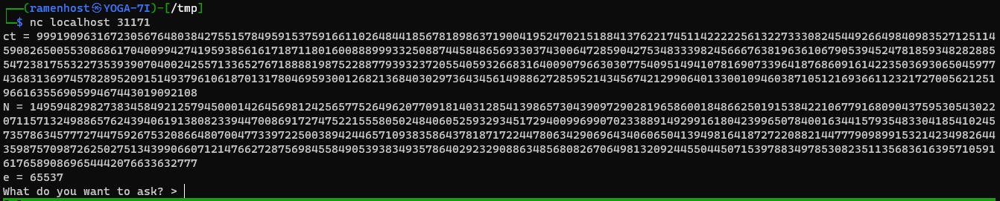
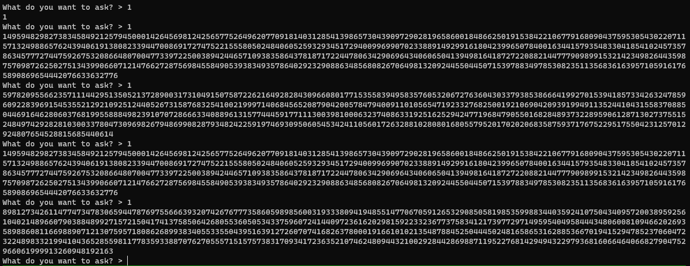

## Challenge 
God is trying to talk to you through a noisy wire.
Use `nc chall.lac.tf 31171` to talk to him.

## TL;DR
The remote service creates a RSA keypair and gives us public key (N, e) and encrypted flag (ct). The goal is find the RSA private key and decrypt the flag.
The remote service also provides an option to calculate square root (mod N) of any numbers of our choice.
Since it uses CRT optimzation to calculate square root (mod N), it leaks multiples of prime factors when input is 1 (sqrt is 1). From leaked values, we can find the prime factors and thus the private key.

## Remote service
On connecting to the remote service, we get following output. We can send inputs to it and observe the output. Based on the interaction, we need to find the private key.


_Challenge_

The code of the remote service that we interact with is given.

```python
from Crypto.Util.number import getPrime, bytes_to_long
import random
def legendre(a, p):
    return pow(a, (p - 1) // 2, p)

def tonelli(n, p):
    q = p - 1
    s = 0
    while q % 2 == 0:
        q //= 2
        s += 1
    if s == 1:
        return pow(n, (p + 1) // 4, p)
    for z in range(2, p):
        if p - 1 == legendre(z, p):
            break
    c = pow(z, q, p)
    r = pow(n, (q + 1) // 2, p)
    t = pow(n, q, p)
    m = s
    t2 = 0
    while (t - 1) % p != 0:
        t2 = (t * t) % p
        for i in range(1, m):
            if (t2 - 1) % p == 0:
                break
            t2 = (t2 * t2) % p
        b = pow(c, 1 << (m - i - 1), p)
        r = (r * b) % p
        c = (b * b) % p
        t = (t * c) % p
        m = i
    return r
def xgcd(a, b):
    if a == 0 :
        return 0,1

    x1,y1 = xgcd(b%a, a)
    x = y1 - (b//a) * x1
    y = x1

    return x,y
def crt(a, b, m, n):
    m1, n1 = xgcd(m, n)
    return ((b *m * m1 + a *n*n1) % (m * n))

def advice(x, p, q):
    if legendre(x, p) != 1:
        exit()
    if legendre(x, q) != 1:
        exit()
    x1 = tonelli(x, p) * random.choice([1, -1])
    x2 = tonelli(x, q) * random.choice([1, -1])
    y = crt(x1, x2, p, q)
    return y

def main():
    p = getPrime(1024)
    q = getPrime(1024)
    N = p * q
    e = 65537
    m = bytes_to_long(b"lactf{redacted?}")
    ct = pow(m, e, N)
    print(f"ct = {ct}")
    print(f"N = {N}")
    print(f"e = {e}")
    while 1:
        x = int(input("What do you want to ask? > "))
        ad = advice(x, p, q)
        print(ad)

if __name__ == "__main__":
    main()
```

From code, we can see it creates a RSA keypair and gives us public key (N, e) and encrypted flag (ct). Our input is sent to `advice()` function and the return value is printed to us.
The code looks overwhelming at first. But based on the function names we can guess what it does.

```python
def advice(x, p, q):
    if legendre(x, p) != 1:
        exit()
    if legendre(x, q) != 1:
        exit()
    x1 = tonelli(x, p) * random.choice([1, -1])
    x2 = tonelli(x, q) * random.choice([1, -1])
    y = crt(x1, x2, p, q)
    return y
```

In short, the `advice()` function calculates square root modulo N using CRT optimization. To explain `legendre(x, p) != 1`, Legendre symbol '1' means the number is a quadratic residue (mod p). i.e. x has a square root in group modulo p. Next, `tonelli()` performs [Tonelli-Shanks](https://en.wikipedia.org/wiki/Tonelli%E2%80%93Shanks_algorithm) algorithm to caluculate a square root of x modulo p (any prime). Instead of calculating square root modulo N directly, this function calculates square root on N's prime factors p and q. When x is our input, x1 is square root (mod p) and x2 is square root (mod q). From x1 and x2, Chinese remainder theorem (CRT) is used calculate square root (mod N), which is the output. An important detail here is that the two square roots are multiplied by one of [1, -1] randomly. This I assume is to use negative square root and positive square root uniformly.

## Solution

An interesting input for this program is `1` as its square root is also `1`.
Let's see what happens on input x=1. We know that `tonelli(1, p) = 1` and `tonelli(1, q) = 1` (square root is also 1).
Depending on the random choice [1, -1], we end up with four possibilities.
<table style="width: 100%">
<thead>
  <tr>
    <th>x</th>
    <th>x1</th>
    <th>x2</th>
    <th>(x2 * p * p' + x1 * q * q') (mod N)</th>
    <th>output</th>
  </tr>
</thead>
<tbody>
  <tr>
    <td>1</td>
    <td>1</td>
    <td>1</td>
    <td>(p p' + q q') (mod N)</td>
    <td>1 (mod N)</td>
  </tr>
  <tr>
    <td>1</td>
    <td>-1</td>
    <td>1</td>
    <td>( -p p' + q q') (mod N)</td>
    <td>( q q' - p p') (mod N)</td>
  </tr>
  <tr>
    <td>1</td>
    <td>1</td>
    <td>-1</td>
    <td>(p p' - q q') (mod N)</td>
    <td>(p p' - q q') (mod N)</td>
  </tr>
  <tr>
    <td>1</td>
    <td>-1</td>
    <td>-1</td>
    <td>( -p p' - q q') (mod N)</td>
    <td>-1 (mod N) ≡ N-1</td>
  </tr>
</tbody>
</table>

By giving input as 1 multiple times, we get 4 different outputs randomly. The fout outputs in below image corresponds to the last column of above table.


_Four distinct outputs for input 1_

As shown in above table, two of them are 1 and (N-1). The other two are the interesting outputs.
Let's consider `(p p' - q q') (mod N)`. From this, we can get multiple of p by adding 1 to it.

> (p p' - q q' + 1) (mod N)  
> &nbsp;=&nbsp; (p p' - q q' + p p' + q q') (mod N)  &nbsp;&nbsp;&nbsp;&nbsp;&nbsp;&nbsp;&nbsp; since, p p' + q q' ≡ 1 (mod p * q)  
> &nbsp;=&nbsp; 2pp' (mod N)  
{: .prompt-info }

Now that we have a multiple of p, we can use gcd to find p,

> p = gcd(2pp', N)  
> q = N / p
{: .prompt-info }

As we have found the prime factors of N, the flag can be decrypted.

### solve.py
```python
from Crypto.Util.number import long_to_bytes
from math import gcd
from pwn import *

conn = remote("chall.lac.tf", 31171)
ct = int(conn.recvline().split()[-1])
N = int(conn.recvline().split()[-1])
e = int(conn.recvline().split()[-1])

pa_minus_qb = 0
qb_minus_pa = 0
while 1:
    conn.recvuntil(b"> ")
    conn.sendline(b"1")
    t = int(conn.recvline())
    if t != 1 and t != N -1:
        if pa_minus_qb == 0:
            pa_minus_qb = t
        else:
            qb_minus_pa = t
            break

# Try to calculate both as one becomes relatively prime to N (gcd 1)
pa = (((pa_minus_qb+1)//2) (mod N))
qb = (((qb_minus_pa+1)//2) (mod N))

p = gcd(pa, N)
q = gcd(qb, N)

# Drop the gcd 1 and take the other
p = q if p == 1 else p

q = N // p
phi_N = (p - 1) * (q - 1)
d = pow(e, -1, int(phi_N))

pt = pow(ct, d, N)
print(long_to_bytes(pt).decode())
```
